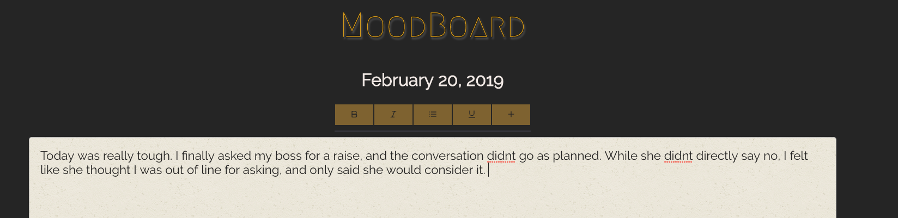
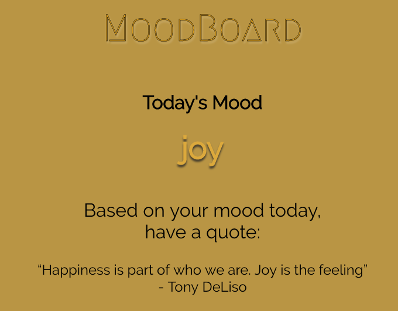
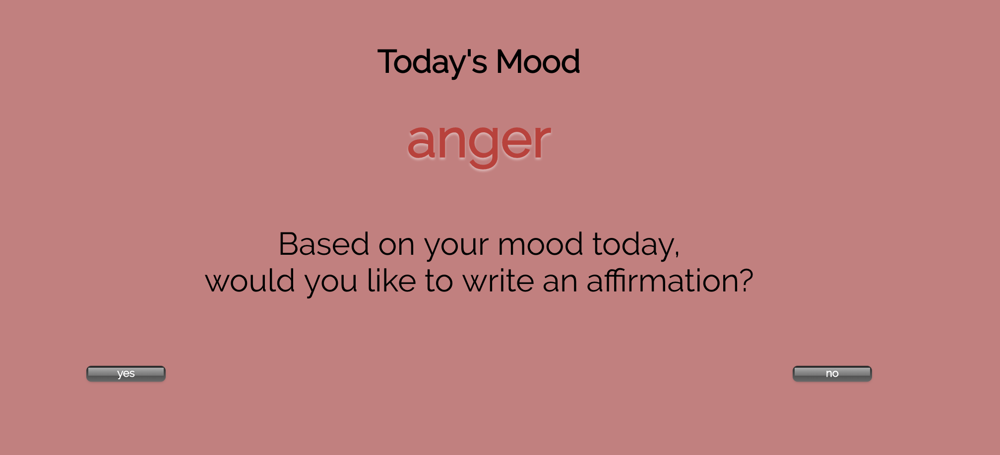
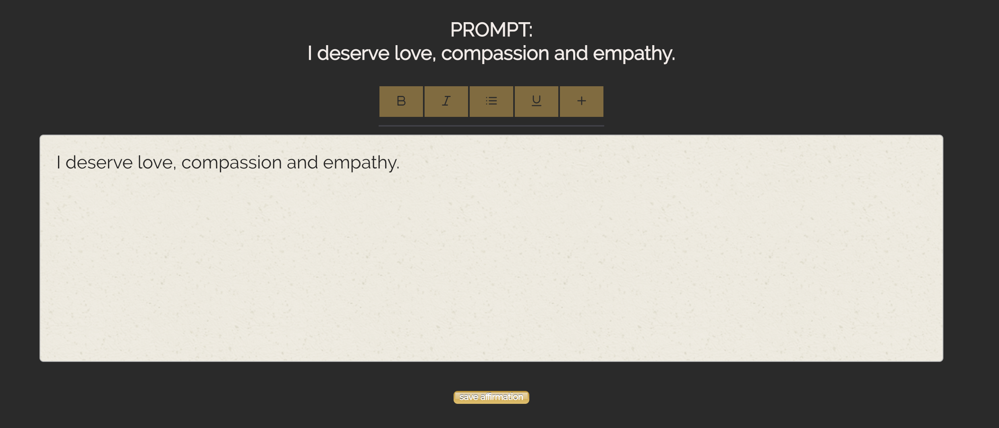

# MoodBoard


MoodBoard is a mobile-optimized daily journaling tool, record of personal reflections, and long-term reference for a user’s projected mood on any given day. Visit https://moodboard-1808.herokuapp.com/ for a live user experience.

## ⚙️ Initial Setup
OS X & Linux:

After cloning this repo:

```sh
npm install
npm start
```
## Features
The user writes and saves a daily journal entry.


The user receives specific and immediate feedback on the most prevalent emotions expressed in their writing. The IBM Watson Tone Analyzer API is used to determine prominent tones.


The user is encouraged to practice self-positivity if the dominant tones expressed in their writing is negative.


The user practices self-positivity by writing an affirmation.


The user's calendar is color coded to represent the dominant mood expressed that day.

The user can view all affirmations written during that month.

## Future Iterations

Planned enhancements include:
- A daily drill-down view into each calendar day, showing the journal entry and affirmations written on that date
- Ability to track daily mood influencers like medications, hormone cycles
- Customize self-positivity prompts / choose between writing affirmations, displaying a mantra, or other activities
- Additional data visualization of user’s mood / tone over time
- Relevant metrics / statistics related to mood / tone

## 🏗 Tech Stack List
- React
- Redux
- Enzyme

## 📥 How To Contribute
1. Fork this repo
2. Create your feature branch (`git checkout -b feature/thingamajig`)
3. Commit your changes (`git commit -am 'Added a cool doodad!'`)
4. Push to the branch (`git push origin feature/thingamajig`)
5. Create a new Pull Request

## 🚀 Core Contributors
**Ashton Bailey**
Github:[https://github.com/amypetrie/](https://github.com/ashtonkbailey/)

**Tanjie Mcmeans**
Github:[https://github.com/normanrs](https://github.com/TMcMeans/)
